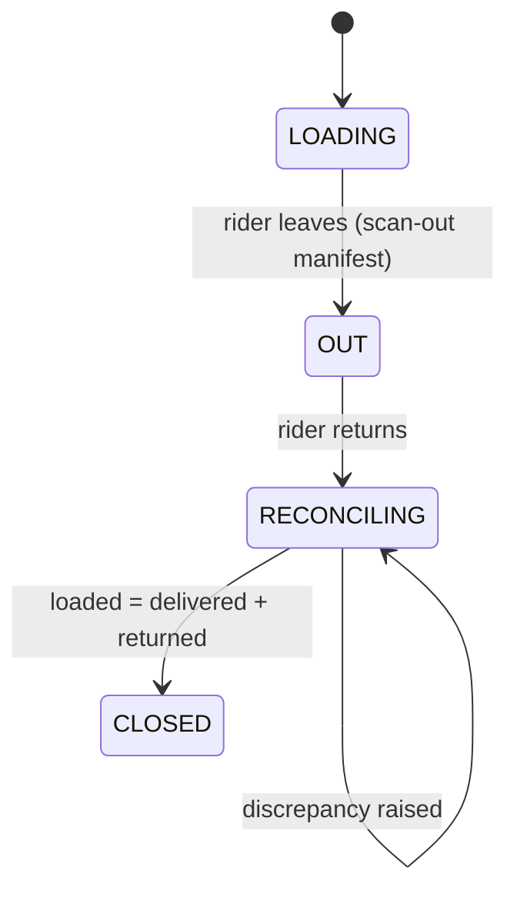
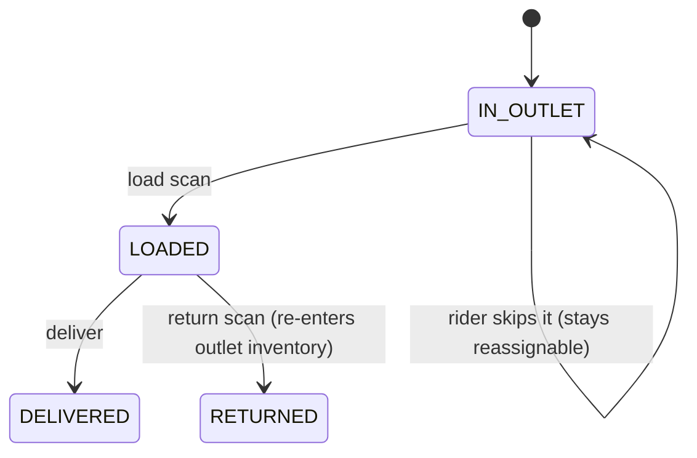

# Barcode Serialization, Batching & Delivery Custody — Design

**Status:** Proposed
**Date:** 2026-06-17
**Deciders:** Management (sponsor), ERP backend owner, Warehouse ops lead, Frontend owner
**Scope:** Adds product-pack hierarchy, batch/lot tracking, box-level serialization, a mobile scanner, and goods-custody tracking through delivery (including partial delivery) to Silo ERP.

This document consolidates three decisions:

- **ADR-0001 — Barcode, batching & box-level serialization**
- **ADR-0002 — Delivery custody & reconciliation ("rider-in-hand" stock)**
- **Addendum — Item-level (partial) delivery**

They are additive: ADR-0002 adds the rider as a third custody holder on top of ADR-0001's chain, and the addendum extends the delivery outcome from order-granular to item/quantity-granular. Read in order.

---

## 0. Context & current system

Silo ERP runs on **FastAPI + SQLAlchemy 2.0 + Postgres** (backend) and **React 19 + Vite (PWA-capable)** (frontend), in an Indian GST/HSN context.

Relevant current state:

- **Inventory** is a flat integer `quantity` per product per outlet (`InventoryResponse`); `NULL` outlet = warehouse. No batch dimension, no box↔unit conversion.
- **Product** stores a single optional `barcode` string and a flat `unit_of_measure` enum (`UnitOfMeasure`). No pack hierarchy.
- **Stock transfers** (`StockTransfer` / `TransferItem`) move integer quantities warehouse → outlet. No box/unit notion, no batch.
- **Orders** carry `delivery_person_id` + `assigned_outlet_id` and move through `OrderStatus` (`pending → delivery_allotted → delivered / attempted / customer_not_available / postponed / cancelled / …`).
- **Delivery**: `DeliveryGuy` belongs to an outlet; `BulkOrderDeliveryAssignment` assigns many orders to one rider; `DeliveryHandover` + `DeliveryGuyCashBalance` reconcile **cash** collected vs handed back.
- There is **no batch/lot entity, no serialization, and no goods-custody tracking** when a rider takes stock out of an outlet.

**Catalogue:** 29 products. Two have a multi-level pack where the transfer unit ≠ the sale unit:

| Product | Box (transfer unit) | Sale unit (to customer) |
|---|---|---|
| Tablet  | 40 tablets / box | 1 tablet |
| Sachet  | 5 sachets / box  | 1 sachet |

Stock moves **factory/warehouse → outlet in boxes**, but is **sold to customers in single units**. The other 27 products are the degenerate case where box = sale unit (`units_per_case = 1`). The design must **not** special-case the two — it models a general pack hierarchy.

**Confirmed requirements:**

- **Traceability depth:** box-level unique serial + batch identity on units (not per-unit unique serials).
- **Label application:** manual, at the warehouse, from pre-printed sheets ("for now at least").
- **Primary drivers:** (1) inventory accuracy at outlets, (2) anti-counterfeit / diversion control.
- **Frontend:** mobile barcode scanner → camera-based scanning in the mobile browser / installable PWA.

---

## ADR-0001 — Barcode, batching & box-level serialization

### Decision

Introduce a **pack hierarchy + batch entity + box-level serialization**, with an **append-only scan-event log** as the backbone for both inventory accuracy and diversion control:

1. Model a **2-level pack hierarchy** on Product (base unit + case). Hold all inventory internally in **base units**.
2. Add a **`batch`** entity (mfg/expiry dates, quantity) — the unit of recall and expiry.
3. Add a **`box_serial`** entity — one row per physical box, with a globally-unique, verifiable serial (`product + batch + sequence + checksum`). This is the scannable logistics object.
4. Units (tablet/sachet) carry a **non-unique `product + batch` mark** for POS — no per-unit uniqueness, no 40 labels per box.
5. Encode codes as **QR using GS1 Digital Link** format (phone-friendly, standards-aligned, web-resolvable).
6. Add an **append-only `box_serial_event`** log — every scan = chain of custody.
7. Frontend scans via a **free JS engine (ZXing / html5-qrcode)** in the PWA, with a defined upgrade path to a commercial SDK.

### Why box-level inventory stays simple

Inventory is always stored in **base units**. Receiving one tablet box = `+40`; selling = `−1`. "Sealed boxes on hand" is **derived for free** from `box_serial` rows at the outlet that are unopened — so you get the boxes-vs-loose view without a second counter. "Opening a box" is a custody **event**, not a stock movement.

### Options considered — serialization granularity (the core decision)

| Option | Complexity | Label cost | Diversion control | Verdict |
|---|---|---|---|---|
| **A. Product + batch only** (no unique serials) | Low | Lowest | None — can't tell two boxes apart | Rejected — fails "sequential numbers" / drivers |
| **B. Box-level serial + batch-on-units** | Medium | Low (~1 label/box, not 40) | Box/case level — catches mis-routed, duplicate, unregistered boxes | **CHOSEN** |
| **C. Full per-unit unique serial** | High | Highest (~40 labels/box + aggregation) | Per-item | Deferred — disproportionate for a manual "for now" rollout |

**Box-level vs the anti-counterfeit driver — explicit trade-off.** Box-level serialization gives genuine diversion control **at the box/case level** (a box meant for Outlet A surfacing at Outlet B, duplicate scans, unregistered boxes). It does **not** trace an individual loose tablet/sachet. That is the accepted gap for a manual phased start; the model has a clean upgrade path to Option C (add a `unit_serial` table with box→unit aggregation) **without** reworking anything above it.

### Barcode symbology & payload — QR / GS1 Digital Link

Phone cameras read 2D (QR/DataMatrix) far more reliably than tiny 1D bars, and 2D holds batch + serial + expiry in one small mark.

```
Box:   https://id.silofortune.com/01/<CASE_GTIN>/10/<BATCH>/21/<SERIAL>?c=<CHK>
Unit:  https://id.silofortune.com/01/<UNIT_GTIN>/10/<BATCH>            (no serial)
```

- `01` = GTIN, `10` = batch/lot, `21` = serial.
- `<SERIAL>` = zero-padded value from a Postgres **sequence** (gapless, race-free — never `max()+1`).
- `<CHK>` = short HMAC/checksum over the payload. **This is the offline anti-counterfeit gate:** a forged or guessed serial fails validation without a DB round-trip.
- Internal-only alternative (no public resolver domain): pipe payload `SF1|<sku>|<batch>|<serial>|<chk>` in a plain QR — same data, no URL.

Print as label sheets (Python `qrcode` + `reportlab` → PDF) with the QR **plus** a human-readable `SKU / BATCH / SERIAL / EXPIRY` line for manual fallback.

### Mobile scanner — web/PWA camera, free engine first

- Start with **`@zxing/browser`** or **`html5-qrcode`** (free; QR, DataMatrix, Code128, EAN) as a React scan component feeding TanStack Query mutations. Camera needs **HTTPS** (already terminated at nginx) and a `manifest.json` for an installable PWA.
- **Upgrade trigger:** poor read rates on the small *unit* mark → move to a commercial SDK (**Strich** or **Scandit**). Native wrapping (Capacitor) only if web-camera latency is unacceptable. Keep the scanner behind a thin interface so the engine is swappable.

### Data model (ADR-0001)

```
Product  (extend)
  + base_uom              e.g. "tablet" / "sachet" / "each"
  + units_per_case        int   (40, 5, … default 1 for the other 27)
  + case_gtin / unit_gtin optional GS1 identifiers
  (existing flat `barcode` → migrate to unit_gtin)

batch
  uid, product_id FK, batch_number, mfg_date, expiry_date,
  quantity_cases, status(active | recalled | depleted), created_at

box_serial                         -- one physical box
  uid, serial_code (UNIQUE), product_id FK, batch_id FK,
  sequence_no, units_per_case (snapshot),
  status(printed | in_warehouse | in_transit | at_outlet | opened | sold | void),
  current_holder_type(warehouse | outlet | delivery_guy),   -- see ADR-0002
  current_holder_id  uuid NULL,                              -- NULL = warehouse
  created_at, updated_at

box_serial_event                   -- append-only chain of custody
  uid, box_serial_id FK,
  event_type(printed | received_wh | transfer_out | received_outlet
             | opened | sold | flagged | adjusted | with_rider | returned),
  holder_type, holder_id NULL, user_id FK, transfer_id FK NULL,
  ts, device_id NULL, note

transfer_box_serial                -- link existing StockTransfer ↔ scanned boxes
  transfer_id FK, box_serial_id FK
```

The existing **Inventory** table keeps its shape (base-unit integer per product/outlet); the serial tables sit alongside and reconcile against it.

### Core workflows (ADR-0001)

- **Generate batch** → reserve N serials from the sequence → render label-sheet PDF.
- **Warehouse-in** → paste labels, scan each box → `in_warehouse`, inventory `+units_per_case`/box; event `received_wh`.
- **Transfer** → scan boxes onto a `StockTransfer` → `in_transit`; on outlet receive, scan again → `at_outlet`, inventory moves by `units_per_case`. A box scanned at the wrong outlet → **flagged** (diversion).
- **Open box at outlet** → `opened` (no stock change; units become loose-sellable).
- **POS sale** → scan unit's product+batch mark → resolve product + price + batch → inventory `−1`.
- **Diversion checks on every scan (server-side):** checksum valid? serial exists & not `void`? not already `sold`? location matches expected? duplicate? → else flag.

### Consequences

- **Easier:** batch recall & expiry tracking; scan-based receiving → outlet inventory accuracy; box-level diversion detection; standards-aligned codes; the 27 simple products fall out as `units_per_case = 1` with no special-casing.
- **Harder:** every hop depends on scan discipline (training + manual-entry fallback); HTTPS camera + PWA work; a label-printing step; an Alembic migration + a backfill (open a "legacy/unserialized" batch so current stock stays valid).
- **Revisit when:** loose-unit diversion appears (→ Option C); poor read rates (→ Strich/Scandit); volume justifies a line applicator.

---

## ADR-0002 — Delivery custody & reconciliation ("rider-in-hand" stock)

### Problem

Assignment is modeled; **goods custody is not.** A rider physically taking stock out of an outlet, delivering it, and bringing the undelivered remainder back is untracked. Cash is reconciled (`DeliveryHandover` / `CashBalance`); **goods are not**. This is the missing half, and it plugs into ADR-0001's custody chain.

### Core modeling insight — three independent axes

The current schema conflates them. Separate them:

```
ASSIGNMENT   (order ↔ rider)        — exists: delivery_person_id
CUSTODY      (where the goods are)  — MISSING: outlet → rider → customer / back
OUTCOME      (delivery result)      — exists: OrderStatus
CASH         (money)               — exists: Handover + CashBalance
```

ADR-0002 adds the **CUSTODY** axis, modeling the **rider as a third holder type** (not a fake outlet).

### High-level flow



**Decision — decrement outlet stock at load-out, not at delivery.** The instant a rider removes goods, the outlet no longer has them, so outlet on-hand must reflect that (inventory-accuracy driver). The "in transit with rider" quantity lives in the ledger and is **visible as rider-in-hand** so it is never lost. Returns add it back.

### Per-order goods custody state



A rider may be assigned N orders but load only some ("may or may not take them out"). Skipped orders stay `IN_OUTLET` and remain reassignable. `OrderStatus` (outcome) and goods custody are independent: an order can be `attempted` while its goods are `returned`.

### Data model (ADR-0002)

`box_serial` gains the generalized **holder** (shown in ADR-0001 schema: `current_holder_type` / `current_holder_id`, plus statuses `with_rider`, `returned`).

```
delivery_trip
  uid, delivery_guy_id FK, outlet_id FK,
  status(loading | out | reconciling | closed),
  opened_by, opened_at, closed_at, closed_by, notes

delivery_stock_event           -- append-only ledger = source of truth
  uid (client-generated UUID for idempotency),
  trip_id FK, order_id FK NULL, product_id FK,
  qty_base_units int, direction(load_out | delivered | returned),
  box_serial_id FK NULL,        -- set for serialized boxes; NULL for loose units
  rider_id, ts, geo_lat NULL, geo_lon NULL, synced_at

delivery_discrepancy
  uid, trip_id FK, product_id FK, expected_qty, actual_qty, diff, reason, resolved_by
```

**Rider-in-hand inventory** = `Σ load_out − Σ delivered − Σ returned` grouped by `(delivery_guy_id, product_id)` from the ledger. Optionally materialize a `delivery_guy_inventory` snapshot for fast reads (rebuildable from the ledger).

**Inventory accounting:** outlet base-unit `quantity` is decremented on `load_out`, incremented on `returned`. `delivered` does **not** touch outlet stock (already gone at load-out).

### API surface (ADR-0002)

```
POST /delivery-trips                      open a trip from assigned orders (status=loading)
POST /delivery-trips/{id}/load            scan goods out → ledger(load_out), outlet inv −,
                                          box_serial.holder=rider; order goods_status=loaded
POST /delivery-trips/{id}/deliver         order delivered → order_status=delivered,
                                          ledger(delivered); cash via existing OrderTransaction/Handover
POST /delivery-trips/{id}/fail            record non-delivery outcome (attempted/CNA/…)
POST /delivery-trips/{id}/return          scan undelivered back → ledger(returned), outlet inv +,
                                          box_serial.holder=outlet, goods_status=returned
POST /delivery-trips/{id}/events          BULK idempotent sync (offline queue drain, dedupe by UUID)
POST /delivery-trips/{id}/close           reconcile: assert loaded = delivered + returned; else flag
GET  /delivery-guys/{id}/inventory        current rider-in-hand stock (per product + serials)
GET  /delivery-trips/{id}/manifest        download for offline (orders, items, serial validation set)
```

### Offline & sync (the part that bites)

Rural delivery (villages/taluks/hoblis) means diversion/checksum checks must run **at the doorstep without network**:

- On trip open (online), the PWA **downloads the manifest**: order items + the set of loaded `box_serial` codes with checksums. Membership + checksum validation then work **offline**.
- Scans write to a **local queue** with a client-generated `event_uuid`; `POST /events` is **idempotent** (dedupe by UUID) so retries/replays are safe.
- Server is authoritative on conflicts: a serial reported `delivered` twice, or by a rider it wasn't loaded to → **flagged** (diversion), not silently accepted.
- Use IndexedDB (or the PWA offline store) + background sync; reconcile on reconnect.

### Reliability & reconciliation

- **Append-only ledger + end-of-trip assertion** is the core guarantee. A trip can't close clean unless goods balance. A shortage at close → `delivery_discrepancy` (diversion signal, parallel to cash reconciliation).
- **Idempotency** on every event prevents double-counting from flaky networks.
- **Monitoring/alerts:** trips left `OUT` past end-of-day; serials stuck `with_rider` > N days; discrepancy rate per rider; orders `loaded` but neither delivered nor returned.
- Scale is tiny — Postgres + the existing app suffice. The hard part is **correctness of custody**, not throughput.

### Trade-offs (ADR-0002)

| Decision | Chosen | Alternative | Why |
|---|---|---|---|
| Custody granularity | **Trip/run** groups a rider's orders | Order-by-order | Matches existing bulk assignment; one clean reconciliation point |
| Rider representation | **Holder type on box_serial** | Fake "rider" outlet | Doesn't pollute outlet lists/reports |
| When outlet stock drops | **At load-out** | At delivery | Outlet on-hand = physically present; in-transit visible via ledger |
| Loose units on van | **Quantity-tracked** (base units) | Per-unit serials | Consistent with ADR-0001 |
| Source of truth | **Append-only ledger**, snapshot derived | Mutable rider-inventory row | Auditable, rebuildable, survives offline replay |

**Accepted limitation:** rider-level shrinkage of loose units is detected at **quantity** granularity, not per-item (whole-box shrinkage *is* serial-traceable).

---

## Addendum — Item-level (partial) delivery

Upgrades the **OUTCOME axis** from order-granular to **item/quantity granular** (deliver 3 of 5 units). The `delivery_stock_event` ledger is already quantity-level, so **no ledger structural change** — what changes is the per-item rollup, order-status derivation, cash/invoicing, and a sealed-box rule.

### Two "didn't deliver all" cases — the reason decides if the order is finished

| Case | Meaning | Remainder | Order outcome |
|---|---|---|---|
| **Customer refused** | Took 3 of 5, rejects the other 2 | Returns to outlet, **permanent non-sale** | `partially_delivered` (remainder cancelled) |
| **Re-attempt** | Delivered 3, **2 still owed** | Returns but order **stays open** | back to `delivery_allotted` for the remaining 2 |

Each delivery event captures, for the undelivered portion, a **disposition**: `customer_refused` (closes the remainder) vs `reattempt` (keeps it open).

### Quantity ladder (per order item)

```
ordered_qty ──► loaded_qty ──► delivered_qty (the sale)
                    │              + returned_qty
                    │                 ├─ reattempt → re-loadable, order stays open
                    │                 └─ refused    → cancelled, order closes short
invariant (per item, per trip):  loaded = delivered + returned
fulfilment (cumulative across trips):  Σ delivered ≤ ordered
order complete when  Σ delivered + Σ refused = ordered
```

`delivered_qty` is **cumulative across trips** (3-of-5 on Monday, remaining 2 on Wednesday).

### Data model deltas (Addendum)

```
order_item  (extend)
  + quantity_delivered  int default 0   -- cross-trip cumulative sale
  + quantity_refused    int default 0   -- permanently rejected
     (remaining = quantity - quantity_delivered - quantity_refused)

delivery_trip_item            -- per-trip, per-item rollup
  uid, trip_id FK, order_id FK, order_item_id FK, product_id FK,
  qty_loaded int, qty_delivered int default 0, qty_returned int default 0,
  return_disposition(reattempt | refused) NULL,
  box_serial_id FK NULL

OrderStatus  (add)
  PARTIALLY_DELIVERED = "partially_delivered"
```

Source-of-truth chain: **`delivery_stock_event` (every movement) → `delivery_trip_item` (per-trip rollup) → `order_item.quantity_delivered` (cumulative)**. All three reconcile; snapshots rebuildable from the ledger.

**Order status becomes a derived rollup over items:**

- all items `quantity_delivered == ordered` → `delivered`
- `0 < Σ delivered < Σ ordered`, remainder all `refused` → `partially_delivered`
- some delivered, remainder `reattempt` → stays `delivery_allotted` (remaining units re-loadable)
- nothing delivered → `attempted` / existing failure statuses

### The sealed-box constraint (important)

A `box_serial` is **atomic** (40 sealed tablets). You **cannot partially deliver a sealed box** — partial delivery applies only to **loose base units**.

- A sealed box is delivered whole or returned whole.
- To split-deliver a serialized product, the rider must **open the box** → `box_serial.status = opened`, its units become loose, then deliver 3 / return 37 as loose units.
- Opening on the road is an auditable **custody-resolution event** (logged with rider + geo); that box's traceability drops to batch level (consistent with the box-level decision).
- `/deliver` must **reject** a partial quantity against a still-sealed `box_serial_id` and require an explicit **open-box** action first.

### API deltas (Addendum)

```
POST /delivery-trips/{id}/deliver
  body: { order_id, items: [ { order_item_id, delivered_qty,
                               undelivered_disposition: reattempt | refused } ],
          payment: {...} }            -- cash recomputed on delivered qty

POST /delivery-trips/{id}/open-box     { box_serial_id }   -- sealed → opened (loose units)

POST /delivery-trips/{id}/return       -- derives per-item qty_returned = loaded − delivered,
                                          tagged reattempt | refused
```

`/close` reconciliation is now **per item**: `Σ qty_loaded = Σ qty_delivered + Σ qty_returned` for every `(trip, order_item)`; mismatch → `delivery_discrepancy`.

### Cash & invoicing — the real ripple

Decision: **invoice on delivered quantity, per delivery event.**

- Cash at the stop = `Σ delivered_qty × unit_price − discounts` (existing `OrderItem` pricing: `cost_price − product_manual_discount`, minus apportioned order `manual_discount`). Flows into the **existing** `OrderTransaction` / `DeliveryHandover` / `CashBalance` — no new cash machinery.
- **Commission** (`Product.commission`, per-unit) accrues on `delivered_qty`, not ordered — auto-correct under partial delivery.
- **Invoice** against delivered units, per delivery (sum of partials = total). `InvoiceType.RETURN` / `CREDIT_NOTE` already exist for the invoice-then-credit path.
- **Prepaid partial refunds — OUT OF SCOPE for now.** Current scope assumes **COD**: the customer pays only for what they accept, so a partial/refused delivery needs **no refund** and the books balance naturally (collect for delivered, return the rest). If prepaid orders are introduced later, a "prepaid for 5, accepts 3" case creates a refund owed for 2 that must surface at the stop (→ `PaymentStatus.REFUNDED` / credit note) — **deferred until prepaid exists.**

### Reconciliation invariant — final form

```
per (trip, order_item):       loaded    = delivered + returned
per order_item (cumulative):  delivered + refused ≤ ordered; order closes when ==
per trip (goods):             Σ loaded_out = Σ delivered + Σ returned
per stop (cash):              collected = Σ delivered_qty × net_price (− prepaid settled)
```

Any break → `delivery_discrepancy` (goods) or a cash variance against `DeliveryGuyCashBalance` (money).

### Trade-offs (Addendum)

| Decision | Choice | Why |
|---|---|---|
| Outcome granularity | **Item + quantity** via `delivery_trip_item` | Customers split-accept; order-level status can't express "3 of 5" |
| Undelivered reason | Explicit `reattempt` vs `refused` | Decides if the order stays open or closes short |
| Sealed box split | **Forbidden; require open-box first** | Box serial is atomic; opening is auditable |
| Billing basis | **Delivered qty, per-delivery invoice** | COD cash matches goods; commission auto-correct |
| Status model | `PARTIALLY_DELIVERED` + **derived** status | One field can't hold per-item truth |

**Accepted limitations:** (1) splitting a serialized product requires opening a box on the road, dropping it to batch-level traceability; (2) per-delivery invoicing means one order can produce multiple invoices across re-attempts — invoice numbering must allow that.

---

## Roles & usage

Seven roles (`UserRole` in `app/utils/constants.py`) interact with the system. RBAC is load-bearing here: the anti-counterfeit / diversion guarantees depend on *who* may scan *what*, and on **two-party handoffs** at every custody boundary.

### Role → responsibility at a glance

| Role | Owns in this system | Primary surface |
|---|---|---|
| **SUPER_ADMIN** | Master data, system config, user mgmt, final authority on discrepancies & voids | Web admin |
| **ADMIN** | Catalogue, batches, transfer approvals, cross-outlet visibility, recalls | Web admin |
| **WAREHOUSE_MANAGER** | Batch creation, label printing, warehouse-in scans, transfer dispatch | Web + scanner |
| **OUTLET_MANAGER** | Transfer receive, open-box, POS sale, audits, load-to-rider, returns, trip close | Web + scanner |
| **TELECALLER** | Creates orders (demand) — minimal barcode contact | Web |
| **ACCOUNTANT** | Cash reconciliation, invoices, credit notes, prepaid refunds, payouts | Web |
| **DELIVERY_GUY** | Rider PWA: load-confirm, deliver (item-level), open-box, collect cash, return | Mobile PWA (offline) |

### Per-role walkthroughs

**SUPER_ADMIN — system owner.** Defines master data (products, `base_uom`, `units_per_case`, GTINs, GS1-vs-internal decision, serial-sequence + HMAC secret); manages users/outlets; holds **final authority on exceptions** — void a serial, force-close a trip with an unresolved `delivery_discrepancy`, override a flagged-diversion block. Sees every audit trail.

**ADMIN — operations manager.** Catalogue edits and **batch** lifecycle (create, mark `recalled`); **approves stock transfers** before dispatch; **runs recalls** (pick batch → list every `box_serial` and its current holder → pull instructions); cross-outlet dashboards for diversion flags, discrepancy rates, expiry.

**WAREHOUSE_MANAGER — source of custody.** Create batch → print labels → **warehouse-in scan** (`in_warehouse`, inventory `+units_per_case`) → **dispatch transfer** (scan boxes onto an approved transfer → `in_transit`). A box never scanned in doesn't exist to the system.

**OUTLET_MANAGER — the busiest role.** Receive transfer (scan in → `at_outlet`; wrong box → diversion flag); open box; **POS sale** (scan unit → price → inventory `−1`); weekly audit (scan-assisted); **open trip + load goods to rider** (outlet inventory drops); **receive returns**; **close & reconcile trip** (`loaded = delivered + returned` per item; mismatch → `delivery_discrepancy`).

**TELECALLER — demand only.** Creates orders (`OrderCreateRequest` / proxy). **No scanner contact** — they generate the orders that become a rider's load.

**ACCOUNTANT — the money side.** Confirms **cash handovers** cross-checked against goods (`collected == Σ delivered_qty × net_price`); **invoices on delivered quantity** (per-delivery, incl. partials); **credit notes / refunds** for `customer_refused` remainders and `prepaid` overpayment; rider payouts/commission (now on delivered units).

**DELIVERY_GUY — offline mobile PWA.** Open trip → **download manifest** (orders + serials + checksums, for offline) → **confirm load** → at each stop deliver item-level (3 of 5; remainder `reattempt`/`refused`; **open-box** to split a sealed box; collect cash) → record failed stops → **return** undelivered goods + hand over cash. Scans queue locally and sync idempotently.

### Permissions matrix (proposed)

| Action | SUPER | ADMIN | WH_MGR | OUTLET_MGR | TELE | ACCT | RIDER |
|---|:--:|:--:|:--:|:--:|:--:|:--:|:--:|
| Define products / `units_per_case` / GTIN | ✅ | ✅ | — | — | — | — | — |
| Create / recall batch | ✅ | ✅ | ✅¹ | — | — | — | — |
| Print labels | ✅ | ✅ | ✅ | — | — | — | — |
| Warehouse-in scan | — | — | ✅ | — | — | — | — |
| Approve transfer | ✅ | ✅ | — | — | — | — | — |
| Dispatch transfer (scan out) | — | — | ✅ | — | — | — | — |
| Receive transfer (scan in) | — | — | — | ✅ | — | — | — |
| Open box | — | — | ✅ | ✅ | — | — | ✅² |
| POS sale (scan) | — | — | — | ✅ | — | — | — |
| Create order | — | ✅ | — | ✅ | ✅ | — | — |
| Assign order to rider | — | ✅ | — | ✅ | — | — | — |
| Open trip / load goods out | — | — | — | ✅ | — | — | — |
| Confirm load (rider side) | — | — | — | — | — | — | ✅ |
| Deliver (item-level) / collect cash | — | — | — | — | — | — | ✅ |
| Receive returns / close trip | — | — | — | ✅ | — | — | — |
| Confirm cash handover | ✅ | ✅ | — | ✅³ | — | ✅ | — |
| Invoices / credit notes / refunds | ✅ | ✅ | — | — | — | ✅ | — |
| Resolve `delivery_discrepancy` | ✅ | ✅⁴ | — | — | — | — | — |
| Void serial / override diversion flag | ✅ | — | — | — | — | — | — |
| View full audit trail | ✅ | ✅ | scoped | scoped | — | scoped | own |

¹ if warehouse owns batches; otherwise admin-only.  ² only via the on-road open-box action.  ³ receiving side.  ⁴ admin resolves routine; super-admin force-closes.

### Two-party handoffs (anti-diversion)

Single-party scans are forgeable by definition. Every custody boundary is a **two-party handoff**, both sides logged to `box_serial_event` / `delivery_stock_event`, with an automatic flag on mismatch:

```mermaid
sequenceDiagram
    participant WH as Warehouse Mgr
    participant OM as Outlet Mgr
    participant R as Delivery Guy
    WH->>OM: 1. dispatch transfer (scan OUT)
    OM->>OM: receive (scan IN) — mismatch → diversion flag
    OM->>R: 2. load goods (scan OUT, outlet inv −)
    R->>R: confirm load on device — mismatch → flag
    R->>OM: 3. return undelivered (rider presents)
    OM->>OM: scan returns IN; trip-close must balance
    OM->>OM: balanced → cash handover accepted
```

1. **Warehouse → outlet.** `WAREHOUSE_MANAGER` dispatches (scan OUT) **and** `OUTLET_MANAGER` receives (scan IN). Quantity/serial mismatch between the two sides raises a diversion flag.
2. **Outlet → rider.** `OUTLET_MANAGER` loads (scan OUT, outlet inventory drops) **and** `DELIVERY_GUY` confirms the load on their device. This is the highest-risk boundary — goods leave a fixed location for a mobile one — so the dual confirmation matters most here.
3. **Rider → outlet (return).** `DELIVERY_GUY` presents undelivered goods **and** `OUTLET_MANAGER` scans them in; the **trip-close reconciliation must balance** (`loaded = delivered + returned`) **before** the cash handover is accepted, so goods and money settle together.

**Invariant:** no serial or quantity changes custody on a single person's word. Each boundary has a giver and a receiver; the ledger records both; a one-sided or mismatched scan is a flag, not a silent accept.

**Open decisions (RBAC):** (a) does `WAREHOUSE_MANAGER` or `ADMIN` own batch creation? (b) the outlet→rider load is specified as a two-party scan — confirm this over a rider-self-scan (strongly recommended to keep two-party).

## Consolidated action items

1. [ ] **Confirm GS1 vs internal codes** — real `id.silofortune.com` resolver (GS1 Digital Link) or internal-only QR payloads? (Recommend GS1 for future retail.)
2. [ ] **Alembic migration:** `batch`, `box_serial` (with holder), `box_serial_event`, `transfer_box_serial`, `delivery_trip`, `delivery_stock_event`, `delivery_trip_item`, `delivery_discrepancy`; extend `Product` (`base_uom`, `units_per_case`) and `order_item` (`quantity_delivered`, `quantity_refused`); add `OrderStatus.PARTIALLY_DELIVERED`; Postgres sequence for serials.
3. [ ] **Backfill plan** for current on-hand inventory → "legacy" batch so existing stock reconciles.
4. [ ] **Label-sheet PDF endpoint** (`qrcode` + `reportlab`): QR + human-readable line.
5. [ ] **Serial service:** generate (with checksum) + validate (checksum, existence, status, location) — the anti-counterfeit gate; works offline against the downloaded manifest.
6. [ ] **Wire serials into Transfer** receive/dispatch (scan-to-confirm).
7. [ ] **POS unit-scan** path: resolve product + batch + price, decrement base units.
8. [ ] **Delivery trip endpoints:** open / load / deliver (item-level) / open-box / fail / return / events (idempotent sync) / close (per-item reconciliation).
9. [ ] **Derived order-status rollup** + `PARTIALLY_DELIVERED`; cash/commission/invoice on delivered quantity (COD — customer pays for what's accepted; **prepaid refunds deferred**).
10. [ ] **Frontend scan component** (ZXing/html5-qrcode) + PWA manifest + HTTPS camera + offline queue (IndexedDB) + background sync; swappable engine interface.
11. [ ] **Define `units_per_case`** for all 29 products (40 / 5 / 1…).
12. [ ] **Ops:** label-application SOP, open-box-on-road SOP, staff training, manual-entry fallback.
13. [ ] **RBAC enforcement:** apply the permissions matrix per role; enforce **two-party handoffs** (warehouse→outlet, outlet→rider, rider→outlet) so each custody boundary records a giver + receiver and flags one-sided/mismatched scans; gate `void serial` / `override diversion flag` to SUPER_ADMIN and `resolve discrepancy` to ADMIN+.

## What to revisit as the system grows

- **Per-unit serialization** (ADR-0001 Option C) if loose-unit diversion/shrinkage becomes material.
- **Strich/Scandit** if small-mark read rates disappoint; **Capacitor** native wrap if web-camera latency is unacceptable.
- **Auto-return on trip close**, **prepaid partial-refund automation**, **re-attempt remainder auto-expiry** after N failed trips.
- **Per-stop signature/photo proof** tied to the `delivered` event for dispute defense.
- **Multi-outlet / multi-day trips**, route optimization, rider-to-rider goods transfer — all extensions of the same ledger.

---

## Appendix A — Worked example: multi-item order, one item refused (COD)

A common real case: an order has two items, the customer accepts one and refuses the other. This is **item-level partial delivery at the line level** (cf. quantity-level within a single line). **COD assumed** — the customer pays only for what they accept, so there is **no refund**.

**Order `#1007` (COD):** `Daily Fortune ×1` (₹450) + `Immuno Fortune ×1` (₹600). Order total ₹1050.

### 1. Load (two-party, at the outlet)
- `OUTLET_MANAGER` scans 1 Daily Fortune + 1 Immuno Fortune onto the trip; `DELIVERY_GUY` confirms load.
- Ledger: `load_out` Daily Fortune ×1, `load_out` Immuno Fortune ×1.
- Outlet inventory: **Daily Fortune −1, Immuno Fortune −1**. Rider-in-hand: 1 + 1. Order goods_status = `loaded`.

### 2. At the doorstep
Customer takes Daily Fortune, refuses Immuno Fortune. Rider delivers Daily Fortune (qty 1), marks the Immuno Fortune line **refused** (qty 1, disposition `refused`), collects **₹450 only**.

Per-line state recorded:

| Line | ordered | delivered | refused | result |
|---|--:|--:|--:|---|
| Daily Fortune | 1 | 1 | 0 | line complete |
| Immuno Fortune | 1 | 0 | 1 | line closed short |

- Ledger: `delivered` Daily Fortune ×1; `returned` Immuno Fortune ×1 (`refused`).
- **Order rollup:** ≥1 unit delivered and all undelivered are `refused` → **`#1007 → partially_delivered`** (remainder closed, not re-attempted).
- Cash collected = **₹450** (not ₹1050). Commission accrues on Daily Fortune only.

### 3. Return + trip close (two-party)
- `DELIVERY_GUY` returns; `OUTLET_MANAGER` scans the Immuno Fortune unit back in.
- Ledger: `returned` Immuno Fortune ×1 → outlet **Immuno Fortune +1** (back to sellable stock).
- Trip-close reconciliation, **per line**:
  - Daily Fortune: `loaded 1 = delivered 1 + returned 0` ✅
  - Immuno Fortune: `loaded 1 = delivered 0 + returned 1` ✅
- Balances → trip closes → cash handover (₹450) accepted.

### 4. Books
- Invoice **Daily Fortune ₹450 only**; Immuno Fortune is **never invoiced** (never sold). **No refund, nothing owed** (COD).

### Variants
- **Re-attempt instead of refuse:** if the customer says "bring it tomorrow," the rider taps **reattempt** on the Immuno Fortune line → the line stays open and the order returns to `delivery_allotted` for a future trip (the unit still returns to the outlet that night). Order does **not** close.
- **Sealed box instead of loose unit:** if the returned item is a serialized sealed box, its `box_serial` simply flips holder `with_rider → at_outlet` — same flow, serial-tracked. (Splitting a sealed box still requires an explicit open-box action; see the partial-delivery addendum.)
