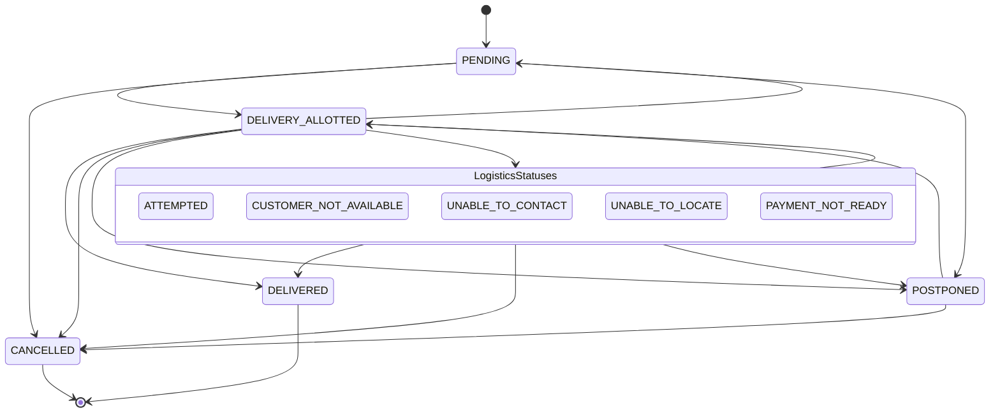

# Valid Order States and Transitions

This document outlines the valid order statuses and their permitted transitions in the Silo ERP system.

## State Transitions Map

Below is a visual representation of how an order can transition between different statuses.

## Detailed Transitions Table

| Current Status | Allowed Next Statuses | Notes |
| :--- | :--- | :--- |
| **`PENDING`** | `DELIVERY_ALLOTTED`, `CANCELLED`, `POSTPONED` | Initial state when an order is created. |
| **`DELIVERY_ALLOTTED`** | `PENDING`, `DELIVERED`, `CANCELLED`, `POSTPONED`, `ATTEMPTED`, `CUSTOMER_NOT_AVAILABLE`, `UNABLE_TO_CONTACT`, `UNABLE_TO_LOCATE`, `PAYMENT_NOT_READY` | Order is assigned to an outlet/delivery person. |
| **`POSTPONED`** | `DELIVERY_ALLOTTED`, `CANCELLED` | Delivery is delayed. |
| **Logistics Statuses*** | `DELIVERY_ALLOTTED`, `DELIVERED`, `CANCELLED`, `POSTPONED` | Represents various delivery attempt outcomes. |
| **`DELIVERED`** | *None (Final State)* | Order successfully fulfilled. |
| **`CANCELLED`** | *None (Final State)* | Order cancelled. Requires remarks. |

> [!NOTE]
> *Logistics Statuses include: `ATTEMPTED`, `CUSTOMER_NOT_AVAILABLE`, `UNABLE_TO_CONTACT`, `UNABLE_TO_LOCATE`, and `PAYMENT_NOT_READY`. Transitioning to any of these statuses requires providing `status_remarks`.
